# 數學科錯題本

---

## 📌 錯題 1：小白兔與小雞的腳數問題（雞兔同籠二元一次方程組）

### 📅 記錄日期：2026-07-26

### 📝 題目敘述
甲對乙說：「我養的寵物小白兔和小雞共有 18 隻，加起來共有 58 隻腳。」
乙對甲說：「不對吧！你是不是弄錯了？」
請問究竟是誰弄錯了呢？
*   (A) 兩人都對
*   (B) 甲錯
*   (C) 乙錯
*   (D) 兩人都錯

### 🏷️ 錯題分類
*   **年級**：七年級下學期
*   **科目**：數學（翰林版）
*   **單元**：第一章 二元一次聯立方程式
*   **核心知識點**：二元一次聯立方程式的應用題（雞兔同籠問題、實際合理性檢驗）

### 🔑 答案
> 💡 **【核心答案】**
> **正確答案：乙錯**

### 💡 完整解析
1. **設定未知數**：
   設小白兔有 $x$ 隻，小雞有 $y$ 隻。
   *   小白兔有 4 隻腳。
   *   小雞有 2 隻腳。

2. **依題意列出聯立方程式**：
   *   總隻數共 18 隻：
       $$x + y = 18 \quad \cdots\cdots (1)$$
   *   總腳數共 58 隻：
       $$4x + 2y = 58 \quad \cdots\cdots (2)$$

3. **解聯立方程式**：
   將第 (1) 式同乘以 2 得到：
   $$2x + 2y = 36 \quad \cdots\cdots (3)$$
   
   **將第 (2) 式減去第 (3) 式**：
   $$(4x + 2y) - (2x + 2y) = 58 - 36$$
   $$2x = 22$$
   $$x = 11$$
   
   將 $x = 11$ 代入第 (1) 式：
   $$11 + y = 18 \implies y = 7$$

4. **合理性檢驗（關鍵步驟）**：
   *   解出來的 $x = 11$（兔）與 $y = 7$（雞）皆為正整數，且其和為 18、腳數和為 $11 \times 4 + 7 \times 2 = 44 + 14 = 58$。
   *   計算結果在數學上與現實邏輯上完全合理（沒有出現負數或分數隻寵物）。
   *   這代表甲說的數量（18隻、58隻腳）是可能發生且合理的。
   *   因此，甲沒有弄錯，反而是「乙」無端懷疑甲，所以是「乙弄錯了」。

---

🔍 <b>原始完整截圖（點擊可展開/收合整個區塊，點擊下方圖片可原地放大/縮小）</b>

<input type="checkbox" id="zoom-m1-src" class="zoom-toggle">
<label for="zoom-m1-src" class="zoom-label">
  
</label>

[🖼️ 查看原始完整截圖（💡 提示：點擊連結開啟圖片後，可將分頁拖曳至右側或按 Ctrl + \ 分割視窗對照）](images/math_1_source.png)

---

## 📌 錯題 2：選舉確定當選票數門檻（一元一次不等式應用）

### 📅 記錄日期：2026-07-26

### 📝 題目敘述
花田村要選村民代表，共有 5 位候選人，從中要選出 2 位，若開出有效票共 12300 張，則候選人至少應得多票才可確定當選？
*   (A) 4101
*   (B) 4100
*   (C) 4102
*   (D) 4103

### 🏷️ 錯題分類
*   **年級**：七年級下學期
*   **科目**：數學（翰林版）
*   **單元**：第五章 一元一次不等式
*   **核心知識點**：一元一次不等式的應用（當選安全票數門檻計算）

### 🔑 答案
> 💡 **【核心答案】**
> **正確答案：4101 (或選 A)**

### 💡 完整解析
1. **理解確定當選（安全門檻）的邏輯**：
   *   要選出 2 位村民代表，意味著如果有 3 個人的票數「同時達到或超過」某個票數，那是不可能的（因為只能有 2 個人當選）。
   *   因此，當一個人的票數，大於「剩下所有人能均分的最大票數」時，他就絕對安全，必定當選。
   *   最嚴苛（最難當選）的情況是：有 3 個人（應當選人數 2 人 + 1 人）均分了所有的選票。
   *   只要你的票數「大於」這 3 個人均分選票的平均值，即使剩下的票全被另外兩個人平分，你也必定當選。

2. **核心計算公式**：
   *   若要選出 $N$ 個名額，假設有 $(N + 1)$ 個競爭者在平分所有選票。
   *   安全得票數門檻必須「大於」：
       $$\frac{\text{總有效票數}}{N + 1}$$
   *   在本題中：安全票數 $> \frac{12300}{2 + 1} = 4100$。因此最少需 $4101$ 票。

> ⚠️ **【🧠 思考盲點與概念釐清】**
> *   **盲點名稱**：搞混「可能當選」與「確定當選」。
> *   **詳細說明**：
>     *   若其他人均為 0 票，第二名「只拿 1 票」也可能當選（稱為【可能當選】）。
>     *   但拿 1 票「無法保證」當選。只要其他人拿到 2 票以上就會落選。
>     *   題目要求的是【確定當選（保證當選）】，即「不論對手多強、票數如何集中，我都 100% 絕對會當選」的最低票數。
> *   **解題思維排除法（口訣記法）**：
>     *   **假想敵設定**：必須假設對手極度強大且團結，會聯手把剩下的票平分，試圖擠下你。
>     *   **核心公式**：選出 $N$ 人，用總票數除以 $(N+1)$，取第一個大於該數的整數。

---

🔍 <b>原始完整截圖（點擊可展開/收合整個區塊，點擊下方圖片可原地放大/縮小）</b>

<input type="checkbox" id="zoom-m2-src" class="zoom-toggle">
<label for="zoom-m2-src" class="zoom-label">
  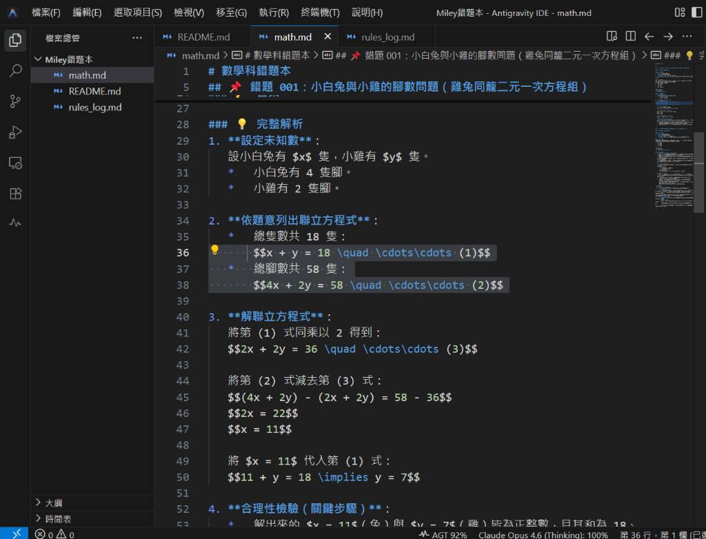
</label>

[🖼️ 查看原始完整截圖（💡 提示：點擊連結開啟圖片後，可將分頁拖曳至右側或按 Ctrl + \ 分割視窗對照）](images/math_2_source.png)

---

## 📌 錯題 3：三角形中點連線段性質的應用（中線與中點的線段計算）

### 📅 記錄日期：2026-07-26

### 📝 題目敘述
三角形 ABC 中，線段 BE、線段 CD 為兩中線，若 M、N 各為線段 BE 及線段 CD 中點，且線段 BC = 12 公分，則線段 MN = 多少公分？
*   (A) 2
*   (B) 2.5
*   (C) 3
*   (D) 4

🔍 <b>題目圖（點擊可展開/收合整個區塊，點擊下方圖片可原地放大/縮小）</b>

<input type="checkbox" id="zoom-m3-q" class="zoom-toggle">
<label for="zoom-m3-q" class="zoom-label">
  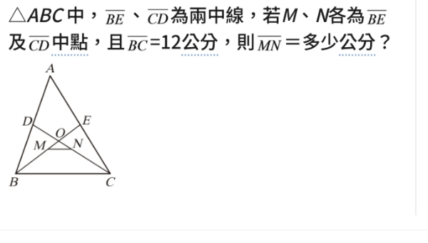
</label>

### 🏷️ 錯題分類
*   **年級**：九年級上學期
*   **科目**：數學（翰林版）
*   **單元**：第一章 相似形
*   **核心知識點**：三角形兩邊中點連線段性質（平行且等於底邊的一半）、梯形對角線中點連線段性質

### 🔑 答案
> 💡 **【核心答案】 正確答案：3 (或選 C)**  
> ⚠️ *(備註：原始解答有錯，請不要參考)*

### 💡 精簡解題步驟（梯形對角線中點連線性質）
無需做繁瑣的輔助線（延伸至 $F$ 點），直接利用「梯形對角線中點連線段公式」即可快速求解：

1. **判定梯形**：
   * 連接 $D$、$E$ 兩點。
   * 因為 $D$、$E$ 分別為 $AB$ 與 $AC$ 的中點（$CD$、$BE$ 為兩中線），根據三角形中點連線段性質：
     $$DE \parallel BC \quad \text{且} \quad DE = \frac{1}{2} BC = \frac{1}{2} \times 12 = 6 \text{ 公分}$$
   * 因為 $DE \parallel BC$ 且長度不相等，故四邊形 $DECB$ 為一個**梯形**（下底 $BC = 12$，上底 $DE = 6$）。

2. **套用梯形對角線中點連線公式**：
   * 在梯形 $DECB$ 中，$BE$ 與 $CD$ 為兩條對角線，而 $M$、$N$ 分別為這兩條對角線的中點。
   * 根據定理：**梯形兩對角線中點連線段長度等於兩底差的一半**
     $$MN = \frac{\text{下底 } BC - \text{上底 } DE}{2}$$

3. **代入計算**：
   * $$MN = \frac{12 - 6}{2} = \frac{6}{2} = 3 \text{ 公分}$$

> ⚠️ **【🧠 思考盲點與概念釐清】**
> *   **盲點說明**：原始解答做輔助線延伸至 $F$ 點的方法較繁瑣，且**原始解答圖片中的推導式寫錯**（誤寫成 $NF = \frac{1}{2}BE = 6$）。
> *   **精簡解題速記**：看到梯形與兩對角線中點，直接套用「兩底差的一半」公式 $MN = \frac{\text{下底} - \text{上底}}{2}$ 即可秒殺此題，完全不需要延伸輔助線！
> *   **原始解答提醒**：原始完整截圖內包含錯誤推導，已加上浮水印標示「解答有誤，請勿參考」。

---

🔍 <b>原始完整截圖（點擊可展開/收合整個區塊，點擊下方圖片可原地放大/縮小）</b>

<input type="checkbox" id="zoom-m3-src" class="zoom-toggle">
<label for="zoom-m3-src" class="zoom-label">
  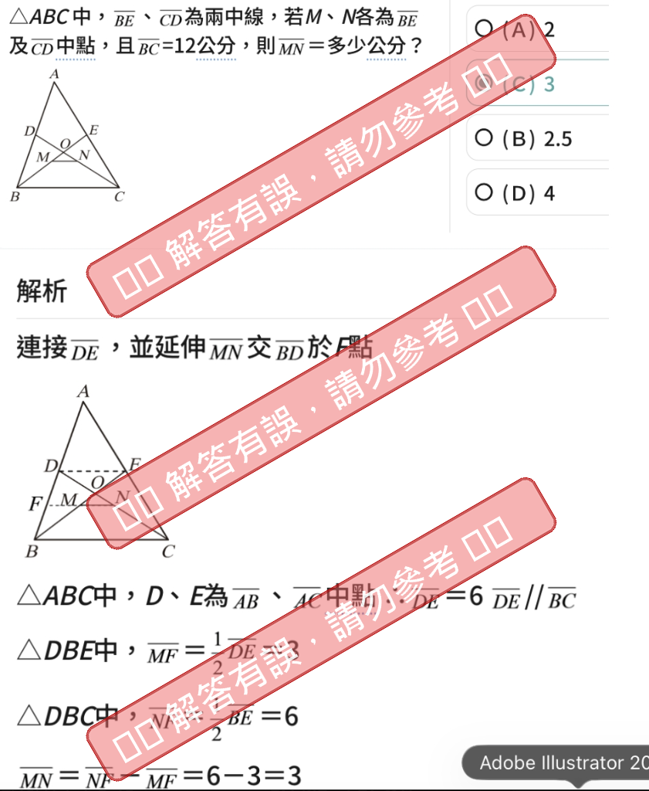
</label>

[🖼️ 查看原始完整截圖（💡 提示：點擊連結開啟圖片後，可將分頁拖曳至右側或按 Ctrl + \ 分割視窗對照）](images/math_3_source.png)

---

## 📌 錯題 4：畢氏定理與代數式展開（斜邊與股長的倍數關係）

### 📅 記錄日期：2026-08-01

### 📝 題目敘述
已知直角三角形中，斜邊長為 $a+2$（實為題目印錯，原題應為 $a+12$），兩股長為 $a-4$、$b$，其中 $a$、$b$ 均為正整數，則 $b^2$ 為下列哪一個數的倍數？
*   (A) 32
*   (B) 34
*   (C) 36
*   (D) 38

🔍 <b>題目圖（點擊可展開/收合整個區塊，點擊下方圖片可原地放大/縮小）</b>

<input type="checkbox" id="zoom-m4-q" class="zoom-toggle">
<label for="zoom-m4-q" class="zoom-label">
  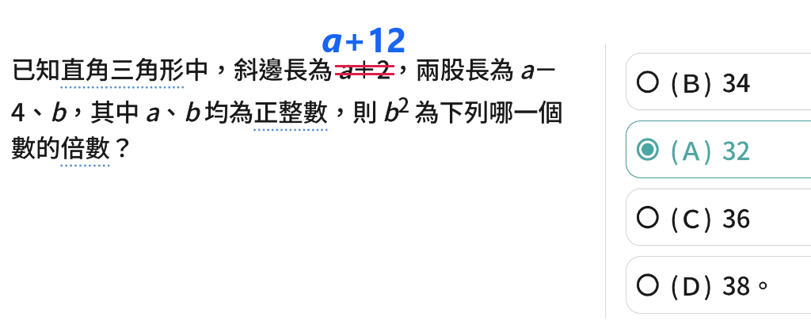
</label>

### 🏷️ 錯題分類
*   **年級**：八年級上學期
*   **科目**：數學（翰林版）
*   **單元**：第二章 根式運算與畢氏定理
*   **核心知識點**：畢氏定理（$a^2 + b^2 = c^2$）、平方差公式（$x^2 - y^2 = (x+y)(x-y)$）、倍數判定

### 🔑 答案
> 💡 **【核心答案】**  
> **正確答案：(A) 32**

### 💡 完整解析與勘誤說明

#### 1. 題目印刷勘誤（關鍵認知）
* **題目圖印刷**：寫「斜邊長為 $a+2$」。若依此計算：
  $$b^2 = (a+2)^2 - (a-4)^2 = (a^2+4a+4) - (a^2-8a+16) = 12a - 12 = 12(a-1)$$
  此時 $b^2$ 為 12 的倍數，但在選項 (A)32, (B)34, (C)36, (D)38 中無恆成立的選項。
* **官方解答對照**：解答第一行直接帶入斜邊長為 **$a+12$**，證實題目圖片的「$a+2$」為印錯（漏印了數字 1）。

#### 2. 正確推導步驟（以斜邊 $a+12$ 為準）
根據畢氏定理（兩股平方和等於斜邊平方）：
$$(a-4)^2 + b^2 = (a+12)^2$$

移項求 $b^2$：
$$b^2 = (a+12)^2 - (a-4)^2$$

利用**平方差公式** $x^2 - y^2 = (x+y)(x-y)$ 快速展開：
* 相加項：$(a+12) + (a-4) = 2a + 8$
* 相減項：$(a+12) - (a-4) = 16$

代回可得：
$$b^2 = (2a + 8) \times 16$$

提出公因數 2：
$$b^2 = 2(a + 4) \times 16 = 32(a + 4)$$

因為 $a$ 為正整數，所以 $(a+4)$ 必為正整數。  
因此 $b^2$ 恆為 **32 的倍數**，故選 **(A)**。

> ⚠️ **【🧠 思考盲點與概念釐清】**
> *   **盲點 1：題目與解答矛盾（題目印錯）**  
>     題目寫 $a+2$ 但解答寫 $a+12$。遇到選項算不出來時，可觀察解答推導，確認是否為考卷題目印錯。
> *   **盲點 2：解答圖片的筆誤**  
>     原始解答圖中寫成 $(2a+16) \times 16 = (a+8) \times 32$，把 $(a+12)+(a-4)$ 誤算為 $2a+16$。雖然該筆誤最後同樣能提出 32 的倍數，但正確的展開式應為 $(2a+8) \times 16 = 32(a+4)$！(解答圖已用紅色刪除線標記錯誤並以藍色加註正確算式 `= (2a+8) ×16`)。

---

🔍 <b>解答圖（已修正標註，點擊可展開/收合整個區塊，點擊下方圖片可原地放大/縮小）</b>

<input type="checkbox" id="zoom-m4-a" class="zoom-toggle">
<label for="zoom-m4-a" class="zoom-label">
  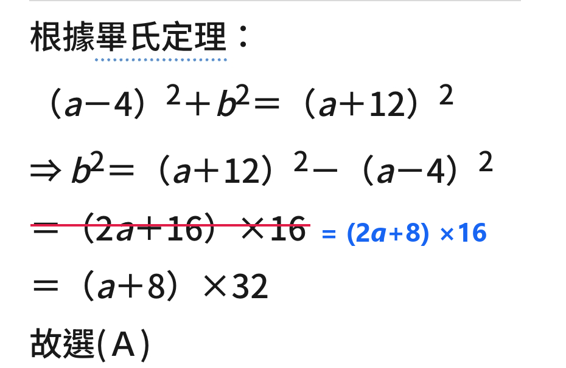
</label>

---

## 📌 錯題 5：相似三角形與長方形比例計算（蝴蝶形/沙漏形相似與輔助線延伸）

### 📅 記錄日期：2026-08-02

### 📝 題目敘述
如圖，$ABCD$ 是長方形，$E$ 點在 $\overline{BC}$ 上，且 $\overline{BE} : \overline{EC} = 3 : 1$，$F$ 為 $\overline{CD}$ 的中點，$\overline{EF}$ 與 $\overline{AC}$ 相交於 $P$ 點，則 $\overline{AP} : \overline{PC} = ?$
*   (A) 7 : 2
*   (B) 5 : 1
*   (C) 4 : 1
*   (D) 3 : 1

🔍 <b>題目圖（點擊可展開/收合整個區塊，點擊下方圖片可原地放大/縮小）</b>

<input type="checkbox" id="zoom-m5-q" class="zoom-toggle">
<label for="zoom-m5-q" class="zoom-label">
  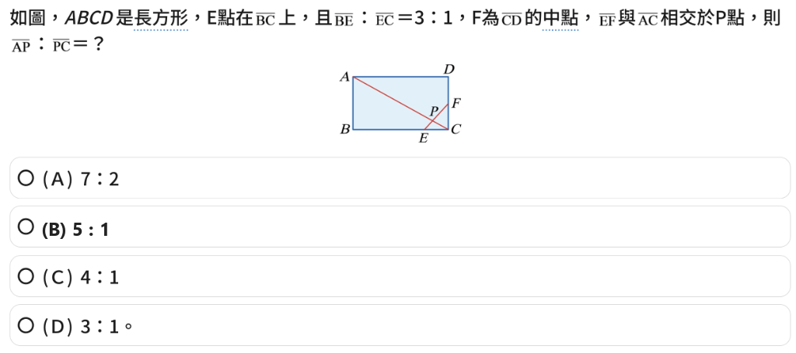
</label>

### 🏷️ 錯題分類
*   **年級**：九年級上學期
*   **科目**：數學（翰林版）
*   **單元**：第一章 相似形
*   **核心知識點**：相似三角形（AA 相似、蝴蝶形/沙漏形相似）、全等三角形（ASA 全等）、輔助線延伸法、線段比例

### 🔑 答案
> 💡 **【核心答案】**  
> **正確答案：(B) 5 : 1**

### 💡 完整解析與解題步驟

#### 方法一：幾何輔助線延伸法（國中標準解法：全等 + 蝴蝶形相似）

1. **做輔助線**：
   * 延長 $\overline{EF}$ 與 $\overline{AD}$ 的延長線交於一點 $Q$。
   
2. **證明三角形全等（$\triangle QDF \cong \triangle ECF$）**：
   * 因為 $ABCD$ 為長方形，故 $\overline{AD} \parallel \overline{BC}$（即 $\overline{QD} \parallel \overline{EC}$）。
   * 由平行線內錯角相等可得：$\angle QDF = \angle ECF = 90^\circ$。
   * 由對頂角相等可得：$\angle DFQ = \angle CFE$。
   * 又已知 $F$ 為 $\overline{CD}$ 的中點，故 $\overline{DF} = \overline{CF}$。
   * 根據 **ASA 全等性質**，可得：
     $$\triangle QDF \cong \triangle ECF$$
   * 因此，對應邊相等：
     $$\overline{QD} = \overline{EC}$$

3. **求出線段長度比例**：
   * 設 $\overline{EC} = 1k$，由已知 $\overline{BE} : \overline{EC} = 3 : 1$，可得 $\overline{BE} = 3k$。
   * 長方形下底長為 $\overline{BC} = \overline{BE} + \overline{EC} = 3k + 1k = 4k$。
   * 因為長方形對邊相等，故上底長 $\overline{AD} = \overline{BC} = 4k$。
   * 結合步驟 2 的全等結果 $\overline{QD} = \overline{EC} = 1k$，可求得整體上邊長：
     $$\overline{QA} = \overline{QD} + \overline{AD} = 1k + 4k = 5k$$

4. **利用蝴蝶形（沙漏形）相似三角形求比例**：
   * 觀察由平行線 $\overline{QA} \parallel \overline{EC}$ 所形成的蝴蝶形相似：
     $$\triangle QPA \sim \triangle EPC \quad (\text{AA 相似})$$
   * 由相似三角形對應邊成比例：
     $$\frac{\overline{AP}}{\overline{PC}} = \frac{\overline{QA}}{\overline{EC}} = \frac{5k}{1k} = \frac{5}{1}$$
   * 故 $\overline{AP} : \overline{PC} = \mathbf{5 : 1}$，選 **(B)**。

---

#### 方法二：直角坐標系法（帶參數 $k$ 與 $h$ 的嚴謹推導：非選擇題通用）

1. **建立坐標系與標示各點座標**：
   * 以 $C$ 為原點 $(0, 0)$。
   * 設長方形長邊 $\overline{BC} = 4k$，由已知 $\overline{BE} : \overline{EC} = 3 : 1$ 可得 $\overline{EC} = 1k$。
   * 設長方形寬邊 $\overline{CD} = 2h$，由 $F$ 為中點可得 $\overline{CF} = 1h$。
   * 各點座標：$C(0, 0)$、$E(-1k, 0)$、$F(0, 1h)$、$A(-4k, 2h)$。

2. **求直線方程式與交點 $P$**：
   * **直線 $AC$**（過 $A(-4k, 2h)$ 與 $C(0, 0)$）：
     斜率 $m = \frac{0 - 2h}{0 - (-4k)} = -\frac{h}{2k} \implies y = -\frac{h}{2k}x \implies hx + 2ky = 0$
   * **直線 $EF$**（過 $E(-1k, 0)$ 與 $F(0, 1h)$）：
     斜率 $m = \frac{1h - 0}{0 - (-1k)} = \frac{h}{k}$，截距為 $1h \implies y = \frac{h}{k}x + 1h \implies hx - ky = -kh$
   * **解聯立求交點 $P$ 的 $y$ 座標**：
     $$(hx + 2ky) - (hx - ky) = 0 - (-kh) \implies 3ky = kh \implies y = \frac{1}{3}h$$
     故交點 $P$ 的 $y$ 座標為 $\frac{1}{3}h$。

3. **利用 $y$ 軸跨度比求線段比**：
   * $\overline{PC}$ 的 $y$ 軸向量跨度 $= \frac{1}{3}h - 0 = \frac{1}{3}h$
   * $\overline{AP}$ 的 $y$ 軸向量跨度 $= 2h - \frac{1}{3}h = \frac{5}{3}h$
   * 故 $\overline{AP} : \overline{PC} = \frac{5}{3}h : \frac{1}{3}h = \mathbf{5 : 1}$。

---

#### 方法三：直角坐標系特設數字法（簡化不帶 $k$ 與 $h$：選擇題極速法）

> 💡 **技巧說明**：因求「線段比例」時縮放不影響結果，選擇題中可不帶 $k$ 與 $h$，直接特設長寬方便極速計算（設 $\overline{BC}=4, \overline{CD}=2$）。

1. **建立坐標系**：
   * 以 $C$ 為原點 $(0, 0)$，設長邊 $\overline{BC} = 4$，寬邊 $\overline{CD} = 2$。
   * 各點座標：$C(0, 0)$、$B(-4, 0)$、$E(-1, 0)$、$D(0, 2)$、$F(0, 1)$、$A(-4, 2)$。

2. **求直線方程式與交點 $P$**：
   * **直線 $AC$**：$y = -\frac{1}{2}x \implies x + 2y = 0$
   * **直線 $EF$**：$y = x + 1 \implies x - y = -1$
   * 解聯立求交點 $P$：$3y = 1 \implies y = \frac{1}{3}, x = -\frac{2}{3}$，故交點 $P\left(-\frac{2}{3}, \frac{1}{3}\right)$。

3. **利用 $y$ 軸跨度比求線段比**：
   * $\overline{PC}$ 的 $y$ 軸跨度 $= \frac{1}{3} - 0 = \frac{1}{3}$
   * $\overline{AP}$ 的 $y$ 軸跨度 $= 2 - \frac{1}{3} = \frac{5}{3}$
   * 故 $\overline{AP} : \overline{PC} = \frac{5}{3} : \frac{1}{3} = \mathbf{5 : 1}$。

> ⚠️ **【🧠 思考盲點與概念釐清】**
> *   **盲點 1：找不到相似三角形（忽略輔助線）**  
>     直接看圖中 $\triangle APC$ 或 $\triangle PEC$ 無法直接求比例。看到長方形邊上的分割點與對角線交點，**主動延長線段構建沙漏形/蝴蝶形相似**（如延長 $EF$ 與 $AD$ 交於 $Q$）是最經典且極速的破題手法！
> *   **盲點 2：忘記對邊長度**  
>     計算 $\overline{QA}$ 時，千萬別漏加原長方形的邊長 $\overline{AD} = 4k$，總長度應為 $\overline{QD} + \overline{AD} = 1k + 4k = 5k$。
> *   **補充 1：幾何全等判定（兩角一邊）**  
>     若已知兩角相等，由內角和 $180^\circ$ 可知三角皆相等。只要配合任一「對應邊」相等，即可根據 **ASA** 或 **AAS** 證明全等（注意邊必須在相對應位置）。
> *   **補充 2：坐標法設定與縮放獨立性**  
>     求「線段比例」且未給具體邊長時，結果與長方形高矮無關（設 $\overline{CD}=h$ 代數運算後 $h$ 會相消）。故坐標法可彈性自訂好算的長度（如設 $\overline{CD}=2$ 使中點 $F$ 為 $(0,1)$）。
> *   **補充 3：直線方程式公式選用**  
>     * **過原點 $(0,0)$**：截距為 $0$，使用 $y = mx$（如直線 $AC: y = -\frac{1}{2}x \implies x+2y=0$）。
>     * **不過原點**：需加上 $y$ 截距 $k$，使用 $y = mx + k$（如直線 $EF: y = 1x + 1 \implies x-y=-1$）。
> *   **補充 4：$x$ 軸與 $y$ 軸跨度比一致性**  
>     斜線比例可直接用 $x$ 軸或 $y$ 軸跨度計算。用 $x$ 軸跨度計算時：$P$ 點 $x=-\frac{2}{3}$，$\overline{PC}$ 的 $x$ 跨度為 $\frac{2}{3}$，$\overline{AP}$ 的 $x$ 跨度為 $4 - \frac{2}{3} = \frac{10}{3}$，比值同樣為 $\frac{10}{3} : \frac{2}{3} = \mathbf{5 : 1}$。

---

🔍 <b>輔助線推導示意圖（點擊可展開/收合整個區塊，點擊下方圖片可原地放大/縮小）</b>

<input type="checkbox" id="zoom-m5-a" class="zoom-toggle">
<label for="zoom-m5-a" class="zoom-label">
  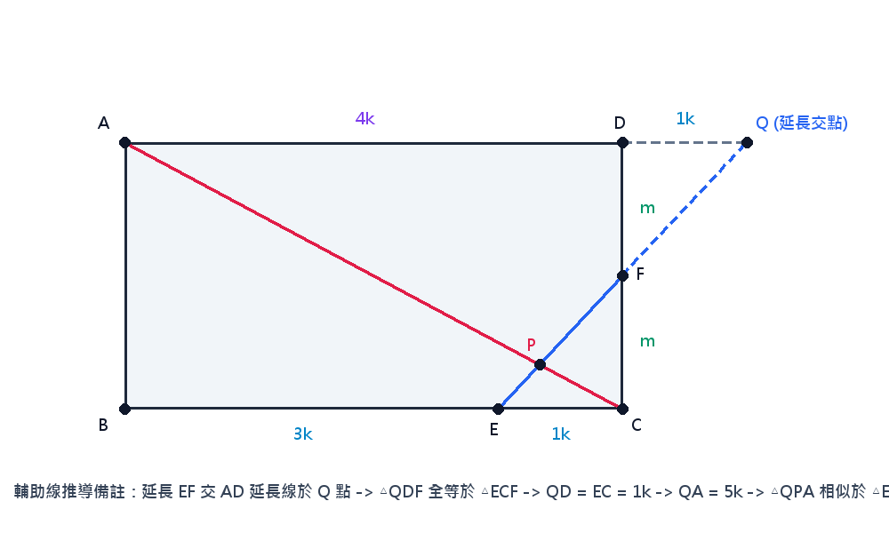
</label>

---

## 📌 錯題 6：三角形內心性質與面積分割（利用內心等距特性求線段距離）

### 📅 記錄日期：2026-08-09

### 📝 題目敘述
如圖，$I$ 為 $\triangle ABC$ 的內心，有一直線通過 $I$ 點且分別與 $\overline{AB}$、$\overline{AC}$ 相交於 $D$ 點、$E$ 點。若 $\overline{AD} = \overline{DE} = 6$，$\overline{AE} = 8$，則 $I$ 點到 $\overline{BC}$ 的距離為何？
*   (A) $\frac{4\sqrt{5}}{5}$
*   (B) $\frac{8\sqrt{5}}{7}$
*   (C) $2$
*   (D) $3$

🔍 <b>題目圖（點擊可展開/收合整個區塊，點擊下方圖片可原地放大/縮小）</b>

<input type="checkbox" id="zoom-m6-q" class="zoom-toggle">
<label for="zoom-m6-q" class="zoom-label">
  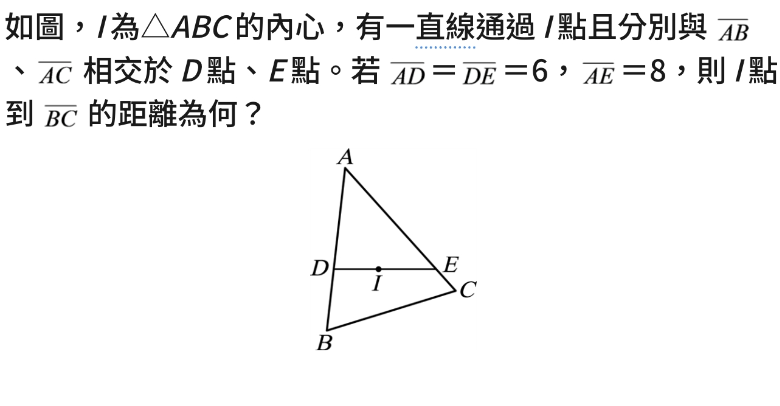
</label>

### 🏷️ 錯題分類
*   **年級**：九年級上學期
*   **科目**：數學（翰林版）
*   **單元**：第三章 三心（內心）
*   **核心知識點**：三角形內心性質（到三邊等距離，且距離等於內切圓半徑 $r$）、三角形面積分割（$\text{Area}(\triangle ADE) = \text{Area}(\triangle ADI) + \text{Area}(\triangle AEI)$）、等腰三角形面積計算

### 🔑 答案
> 💡 **【核心答案】**  
> **正確答案：(B) $\frac{8\sqrt{5}}{7}$**

### 💡 完整解析與解題步驟

1. **理解內心性質與距離轉化**：
   * 因為 $I$ 為 $\triangle ABC$ 的內心，根據內心定義，$I$ 點到 $\triangle ABC$ 三邊（$\overline{AB}$、$\overline{AC}$、$\overline{BC}$）的垂直距離皆相等，且等於 $\triangle ABC$ 的內切圓半徑，設此距離為 $r$。
   * 因此，要求「$I$ 點到 $\overline{BC}$ 的距離」，即可轉化為求「$I$ 點到 $\overline{AB}$ 的距離」或「$I$ 點到 $\overline{AC}$ 的距離」。

2. **利用面積分割建立等式**：
   * 由於直線 $DE$ 通過 $I$ 點，且 $D$ 在 $\overline{AB}$ 上、$E$ 在 $\overline{AC}$ 上，$I$ 點位於線段 $\overline{DE}$ 上。
   * 我們可以將 $\triangle ADE$ 分割為兩個三角形：$\triangle ADI$ 與 $\triangle AEI$。
   * 因此，面積關係為：
     $$\text{Area}(\triangle ADE) = \text{Area}(\triangle ADI) + \text{Area}(\triangle AEI)$$
   * 其中：
     * $\triangle ADI$ 的底為 $\overline{AD}$，高為 $I$ 到 $\overline{AB}$ 的垂直距離 $r$，所以：
       $$\text{Area}(\triangle ADI) = \frac{1}{2} \times \overline{AD} \times r$$
     * $\triangle AEI$ 的底為 $\overline{AE}$，高為 $I$ 到 $\overline{AC}$ 的垂直距離 $r$，所以：
       $$\text{Area}(\triangle AEI) = \frac{1}{2} \times \overline{AE} \times r$$
   * 代入面積分割等式可得：
     $$\text{Area}(\triangle ADE) = \frac{1}{2} \times \overline{AD} \times r + \frac{1}{2} \times \overline{AE} \times r = \frac{1}{2} \times (\overline{AD} + \overline{AE}) \times r$$

3. **計算 $\triangle ADE$ 的面積**：
   * 已知 $\overline{AD} = \overline{DE} = 6$，$\overline{AE} = 8$。
   * $\triangle ADE$ 為等腰三角形（$\overline{AD} = \overline{DE} = 6$，以 $\overline{AE}$ 為底邊）。
   * 自頂點 $D$ 向底邊 $\overline{AE}$ 作垂直高線，交 $\overline{AE}$ 於中點 $M$，則：
     $$\overline{AM} = \frac{1}{2} \overline{AE} = \frac{1}{2} \times 8 = 4$$
   * 根據畢氏定理，$\triangle ADE$ 的高為：
     $$\overline{DM} = \sqrt{\overline{AD}^2 - \overline{AM}^2} = \sqrt{6^2 - 4^2} = \sqrt{36 - 16} = \sqrt{20} = 2\sqrt{5}$$
   * 故 $\triangle ADE$ 的面積為：
     $$\text{Area}(\triangle ADE) = \frac{1}{2} \times \overline{AE} \times \overline{DM} = \frac{1}{2} \times 8 \times 2\sqrt{5} = 8\sqrt{5}$$

4. **求出距離 $r$**：
   * 將已知數據代入步驟 2 的等式中：
     $$8\sqrt{5} = \frac{1}{2} \times (6 + 8) \times r$$
     $$8\sqrt{5} = 7r$$
     $$r = \frac{8\sqrt{5}}{7}$$
   * 因此，$I$ 點到 $\overline{BC}$ 的距離為 $\frac{8\sqrt{5}}{7}$，選 **(B)**。

> ⚠️ **【🧠 思考盲點與概念釐清】**
> *   **盲點 1：誤以為 $I$ 是 $\triangle ADE$ 的內心**  
>     * $I$ 是大三角形 $\triangle ABC$ 的內心，並非小三角形 $\triangle ADE$ 的內心！
>     * 雖然 $I$ 在線段 $\overline{DE}$ 上，這並不代表 $\overline{DE}$ 是內切圓的切線，也不代表 $I$ 到 $\overline{DE}$ 的距離是 $r$。
>     * **核心觀念**：只有當點是某三角形的內心時，它到該三角形三邊的距離才相等。這裡 $I$ 到 $\overline{AB}$、$\overline{AC}$、$\overline{BC}$ 的距離均為 $r$，但到 $\overline{DE}$ 的距離並非 $r$。
> *   **盲點 2：無法將 $I$ 點的距離與 $\triangle ADE$ 連結**  
>     * 看到內心時，應直覺想到「到三邊垂直距離相等（即內切圓半徑 $r$）」。
>     * 看到通過內心 $I$ 的截線 $DE$ 時，應聯想到利用「面積分割法」建立與兩側邊（$\overline{AB}$、$\overline{AC}$）的距離關係，這是求內心相關距離的經典題型！

---

🔍 <b>原始完整截圖（點擊可展開/收合整個區塊，點擊下方圖片可原地放大/縮小）</b>

<input type="checkbox" id="zoom-m6-src" class="zoom-toggle">
<label for="zoom-m6-src" class="zoom-label">
  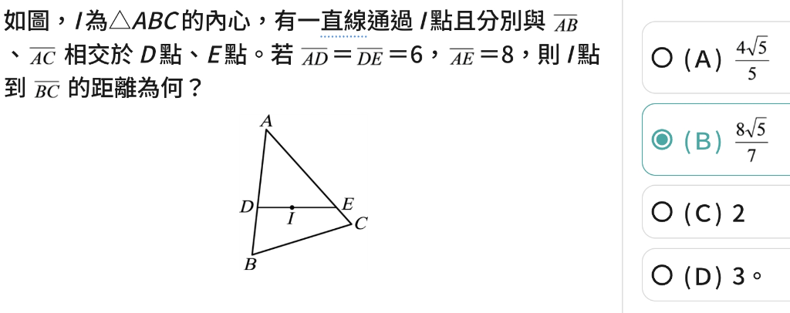
</label>

[🖼️ 查看原始完整截圖（💡 提示：點擊連結開啟圖片後，可將分頁拖曳至右側或按 Ctrl + \ 分割視窗對照）](images/math_6_source.png)

---

## 📌 錯題 7：三人年齡關係與聯立方程式（年齡差不變與回推年齡應用題）

### 📅 記錄日期：2026-08-09

### 📝 題目敘述
周傑倫、張跟碩、山下製酒三位明星在後臺聚首，聊天之間討論到個人的年齡問題：
*   **周傑倫說**：「山下製酒，幾年後你到我現在這年齡時，我已經 32 歲。」
*   **張跟碩說**：「周傑倫，我也不過才小你兩歲而已。」
*   **山下製酒說**：「張跟碩，幾年前你在我現在這年齡時，我也才 16 歲而已。」
*   **此時經紀公司老闆老 $K$ 突然跳出來說**：「我最老，你們三個現在年齡相加就是我今年歲數。」
請問老 $K$ 今年幾歲？
*   (A) 72
*   (B) 70
*   (C) 68
*   (D) 75

🔍 <b>題目圖（點擊可展開/收合整個區塊，點擊下方圖片可原地放大/縮小）</b>

<input type="checkbox" id="zoom-m7-q" class="zoom-toggle">
<label for="zoom-m7-q" class="zoom-label">
  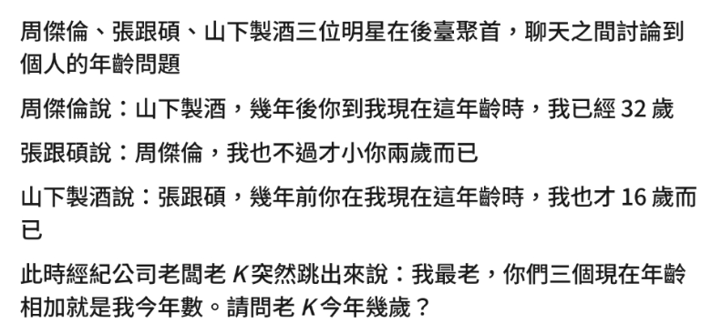
</label>

### 🏷️ 錯題分類
*   **年級**：七年級下學期
*   **科目**：數學（翰林版）
*   **單元**：第一章 二元一次聯立方程式
*   **核心知識點**：二元一次聯立方程式、三元一次聯立方程式、年齡問題（「年齡差不變」概念、過去與未來時間線回推）

### 🔑 答案
> 💡 **【核心答案】**  
> **正確答案：(B) 70 歲**

### 💡 完整解析與解題步驟

#### 1. 設定變數與目標
*   設周傑倫現在的年齡為 $J$ 歲。
*   設張跟碩現在的年齡為 $Z$ 歲。
*   設山下製酒現在的年齡為 $S$ 歲。
*   目標是求老 $K$ 的年齡，即：$K = J + Z + S$。

#### 2. 依據題目對話列出方程式

*   **條件一**：「周傑倫說：山下製酒，幾年後你到我現在這年齡時，我已經 32 歲。」
    *   山下製酒現在 $S$ 歲，要到周傑倫現在的年齡 $J$ 歲，需要經過 $(J - S)$ 年。
    *   這時周傑倫的年齡為現在的年齡加上經過的年數，即：
        $$J + (J - S) = 32 \implies 2J - S = 32 \quad \cdots\cdots (1)$$

*   **條件二**：「張跟碩說：周傑倫，我也不過才小你兩歲而已。」
    *   這代表張跟碩的年齡比周傑倫小 2 歲，即：
        $$Z = J - 2 \quad \cdots\cdots (2)$$

*   **條件三**：「山下製酒說：張跟碩，幾年前你在我現在這年齡時，我也才 16 歲而已。」
    *   張跟碩現在 $Z$ 歲，他在山下製酒現在年齡 $S$ 歲的時候，是 $(Z - S)$ 年前。
    *   那時山下製酒的年齡為現在的年齡減去過去的年數，即：
        $$S - (Z - S) = 16 \implies 2S - Z = 16 \quad \cdots\cdots (3)$$

#### 3. 求解聯立方程式
將上述三式聯立：
1.  $$2J - S = 32 \quad \cdots\cdots (1)$$
2.  $$Z = J - 2 \quad \cdots\cdots (2)$$
3.  $$2S - Z = 16 \quad \cdots\cdots (3)$$

*   **步驟 A**：將第 (2) 式的 $Z = J - 2$ 代入第 (3) 式中：
    $$2S - (J - 2) = 16$$
    $$2S - J + 2 = 16$$
    $$-J + 2S = 14 \implies J = 2S - 14 \quad \cdots\cdots (4)$$

*   **步驟 B**：將第 (4) 式的 $J = 2S - 14$ 代入第 (1) 式中：
    $$2(2S - 14) - S = 32$$
    $$4S - 28 - S = 32$$
    $$3S - 28 = 32$$
    $$3S = 60 \implies S = 20$$

*   **步驟 C**：將 $S = 20$ 代回各項求出 $J$ 與 $Z$：
    *   由第 (4) 式：$J = 2(20) - 14 = 40 - 14 = 26$ 歲。
    *   由第 (2) 式：$Z = 26 - 2 = 24$ 歲。

#### 4. 計算老 $K$ 的年齡
*   老 $K$ 的年齡為三人年齡之和：
    $$K = J + Z + S = 26 + 24 + 20 = 70 \text{ 歲}$$
*   因此，老 $K$ 今年 70 歲，答案選 **(B)**。

> ⚠️ **【🧠 思考盲點與概念釐清】**
> *   **盲點 1：搞混時間線的「前」與「後」**
>     *   「你到我現在這年齡時」代表時間往後（未來），所以是用「現在年齡 + 年齡差」。
>     *   「你在我現在這年齡時」代表時間往前（過去），所以是用「現在年齡 - 年齡差」。
> *   **盲點 2：忘記「兩人的年齡差」是恆等不變的**
>     *   不論時間如何流逝，周傑倫與山下製酒的年齡差永遠是 $(J - S)$，張跟碩與山下製酒的年齡差永遠是 $(Z - S)$。
>     *   利用「年齡差不變」的觀念可以快速檢驗：
>         *   周傑倫比山下製酒大 6 歲（$26 - 20 = 6$）。所以山下製酒 26 歲時，周傑倫 $26 + 6 = 32$ 歲。
>         *   張跟碩比山下製酒大 4 歲（$24 - 20 = 4$）。所以張跟碩 20 歲時，山下製酒 $20 - 4 = 16$ 歲。

---

🔍 <b>原始完整截圖（點擊可展開/收合整個區塊，點擊下方圖片可原地放大/縮小）</b>

<input type="checkbox" id="zoom-m7-src" class="zoom-toggle">
<label for="zoom-m7-src" class="zoom-label">
  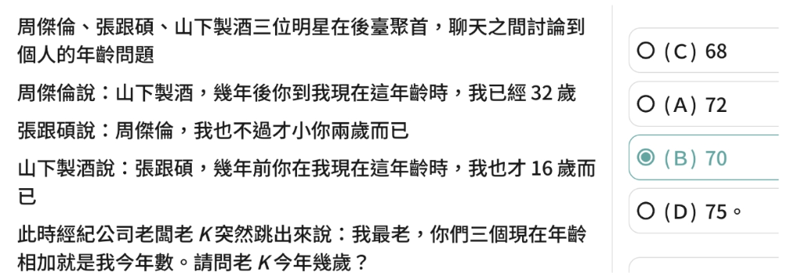
</label>

[🖼️ 查看原始完整截圖（💡 提示：點擊連結開啟圖片後，可將分頁拖曳至右側或按 Ctrl + \ 分割視窗對照）](images/math_7_source.png)

---

## 📌 錯題 8：平行線截比例線段與連比計算（三角形中點與平行截線）

### 📅 記錄日期：2026-08-16

### 📝 題目敘述
如圖，$\triangle ABC$ 中，$M$ 是 $\overline{AB}$ 的中點，$\overline{CM}$ 上取一點 $N$，使 $\overline{CN} : \overline{NM} = 7 : 4$，且 $\overline{MP} \parallel \overline{AN}$，交 $\overline{BC}$ 於 $P$，延長 $\overline{AN}$ 交 $\overline{BC}$ 於 $Q$，若 $\overline{BC} = 15$，則 $\overline{BP} = ?$

🔍 <b>題目圖（點擊可展開/收合整個區塊，點擊下方圖片可原地放大/縮小）</b>

<input type="checkbox" id="zoom-m8-q" class="zoom-toggle">
<label for="zoom-m8-q" class="zoom-label">
  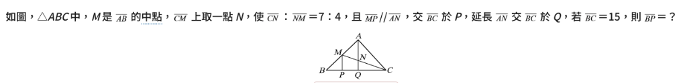
</label>

### 🏷️ 錯題分類
*   **年級**：九年級上學期
*   **科目**：數學（翰林版）
*   **單元**：第一章 相似形
*   **核心知識點**：平行線截比例線段定理、三角形中點與平行線截線性質、三線段連比轉換

### 🔑 答案
> 💡 **【核心答案】**  
> **正確答案：4**

### 💡 完整解析與解題步驟

#### 1. 利用平行線截比例線段定理求 $\overline{CQ} : \overline{PQ}$ 的比
在 $\triangle CMP$ 中，因為 $\overline{AN} \parallel \overline{MP}$（即 $\overline{AQ} \parallel \overline{MP}$）：  
根據平行線截比例線段定理，線段成比例：
$$\overline{CN} : \overline{NM} = \overline{CQ} : \overline{PQ} = 7 : 4$$

#### 2. 利用平行線與中點性質求 $\overline{BP} : \overline{PQ}$ 的比
在 $\triangle ABQ$ 中，因為 $M$ 為 $\overline{AB}$ 的中點，且 $\overline{MP} \parallel \overline{AQ}$：  
根據平行線截比例線段定理（或中位線平行截線性質），$P$ 點必定為 $\overline{BQ}$ 的中點：
$$\overline{BP} : \overline{PQ} = 1 : 1$$

#### 3. 整合三線段連比並求出 $\overline{BP}$ 長度
已知 $\overline{BP} : \overline{PQ} = 1 : 1$ 且 $\overline{CQ} : \overline{PQ} = 7 : 4$，將共同項 $\overline{PQ}$ 統一設為 $4$ 份：
$$\overline{BP} : \overline{PQ} : \overline{CQ} = 4 : 4 : 7$$

整條底邊 $\overline{BC} = \overline{BP} + \overline{PQ} + \overline{CQ}$ 的總份數為：
$$4 + 4 + 7 = 15 \text{ 份}$$

已知 $\overline{BC} = 15$，因此每 $1$ 份的實際長度為 $1$。  
故線段 $\overline{BP}$ 的長度為：
$$\overline{BP} = \frac{4}{4 + 4 + 7} \times \overline{BC} = \frac{4}{15} \times 15 = 4$$

> ⚠️ **【🧠 思考盲點與概念釐清】**
> *   **盲點 1：找不到平行線截線段比的過渡橋樑**  
>     本題關鍵在於利用 $\overline{AQ} \parallel \overline{MP}$ 作為兩組平行截線的橋樑：一組在 $\triangle CMP$ 中將 $\overline{CN}:\overline{NM}$ 轉化到底邊的 $\overline{CQ}:\overline{PQ}$；另一組在 $\triangle ABQ$ 中將腰邊中點 $M$ 轉化到底邊中點 $P$。
> *   **盲點 2：連比轉換時比例項未對齊**  
>     已知 $\overline{BP} : \overline{PQ} = 1 : 1$ 與 $\overline{CQ} : \overline{PQ} = 7 : 4$ 時，需將共同項 $\overline{PQ}$ 擴分對齊為相同份數（同乘以 $4$ 變為 $4$），才能結合為三連比 $\overline{BP} : \overline{PQ} : \overline{CQ} = 4 : 4 : 7$。

---

🔍 <b>原始完整截圖（點擊可展開/收合整個區塊，點擊下方圖片可原地放大/縮小）</b>

<input type="checkbox" id="zoom-m8-src" class="zoom-toggle">
<label for="zoom-m8-src" class="zoom-label">
  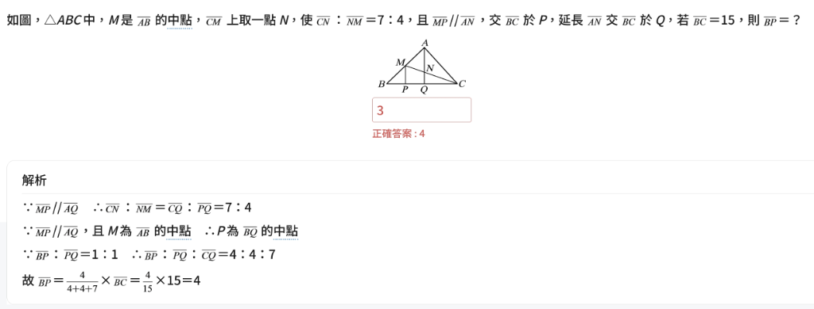
</label>

[🖼️ 查看原始完整截圖（💡 提示：點擊連結開啟圖片後，可將分頁拖曳至右側或按 Ctrl + \ 分割視窗對照）](images/math_8_source.png)

