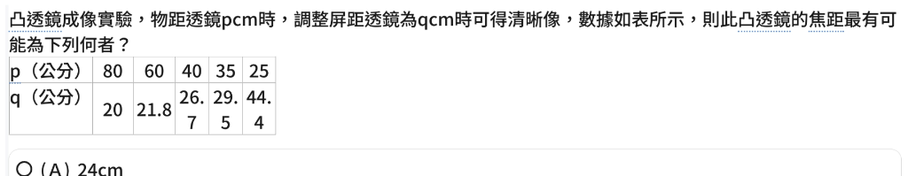

# 自然科（理化）錯題本

---

## 📌 錯題 1：凸透鏡成像實驗與焦距判斷（物距與像距數據分析與不等式逼近法）

### 📅 記錄日期：2026-08-22

### 📝 題目敘述
凸透鏡成像實驗，物距透鏡 $p\text{ cm}$ 時，調整屏距透鏡為 $q\text{ cm}$ 時可得清晰像，數據如表所示，則此凸透鏡的焦距最有可能是下列何者？

| $p$（公分） | 80 | 60 | 40 | 35 | 25 |
| :---: | :---: | :---: | :---: | :---: | :---: |
| $q$（公分） | 20 | 21.8 | 26.7 | 29.5 | 44.4 |

*   (A) $24\text{ cm}$
*   (B) $20\text{ cm}$
*   (C) $16\text{ cm}$
*   (D) $12\text{ cm}$

### 🏷️ 錯題分類
*   **年級**：八年級上學期
*   **科目**：自然（理化）
*   **單元**：第四章 光、顏色與影像（透鏡的成像性質）
*   **核心知識點**：凸透鏡成像規律、物距 $p$ 與像距 $q$ 的對稱性、兩倍焦距等大實像點逼近法、透鏡成像公式

---

### 🔑 答案
> 💡 **【核心答案】**
> **正確答案：(C) $16\text{ cm}$**

---

### 💡 完整解析

#### 🌟 破題方法一：【國中會考首選】「兩倍焦距等大實像點」逼近法
1. **凸透鏡核心分界規律**：
   * 當物體放在**兩倍焦距上（$p = 2f$）**時，會在另一側兩倍焦距處形成**等大倒立實像（$q = 2f$）**。此時 $p = q = 2f$。
   * 當 $p > 2f$（物在 $2f$ 外）時，像在 $f \sim 2f$ 之間（$f < q < 2f$），此時 $p > q$（倒立縮小實像）。
   * 當 $f < p < 2f$（物在 $f \sim 2f$ 內）時，像在 $2f$ 外（$q > 2f$），此時 $p < q$（倒立放大實像）。

2. **觀察表格數據的「交叉轉折點」**：
   * 觀察第四組數據：$p = 35$、$q = 29.5$（此時 $p > q$，物距略大於像距，表示 $p > 2f > q$）。
   * 觀察第五組數據：$p = 25$、$q = 44.4$（此時 $p < q$，物距小於像距，表示 $q > 2f > p$）。
   * 由此可知，$p = q = 2f$（等大像）的轉折點必定落在 **$p = 25 \sim 35$ 之間**！
   * 所以兩倍焦距 $2f$ 的範圍為：$$25 < 2f < 35 \implies 12.5 < f < 17.5\text{ cm}$$
   * 對照選項：(A) 24、(B) 20、(C) 16、(D) 12，僅有 **(C) 16 cm** 符合此範圍！

---

#### 🌟 破題方法二：嚴格不等式夾擠法（原題解析詳解）
1. 由第四組數據 $p = 35 > q = 29.5$：
   * 物在兩倍焦距外：$35 > 2f \implies f < \frac{35}{2} = 17.5\text{ cm}$
   * 像在焦距與兩倍焦距間：$f < 29.5 < 2f \implies 2f > 29.5 \implies f > 14.75\text{ cm}$
   * 綜合得出焦距範圍：$$14.75 < f < 17.5\text{ cm}$$
   * 四個選項中只有 **$16\text{ cm}$** 落在該區間內！

---

#### 🌟 破題方法三：【秒殺驗算法】薄透鏡成像公式 $\frac{1}{f} = \frac{1}{p} + \frac{1}{q}$
利用第一組整數數據 $p = 80$、$q = 20$ 直接代入：
$$\frac{1}{f} = \frac{1}{p} + \frac{1}{q} = \frac{1}{80} + \frac{1}{20} = \frac{1 + 4}{80} = \frac{5}{80} = \frac{1}{16}$$
$$\implies f = 16\text{ cm}$$
（第二組 $p=40, q=26.7 \approx \frac{80}{3} \implies \frac{1}{f} = \frac{1}{40} + \frac{3}{80} = \frac{5}{80} = \frac{1}{16} \implies f = 16\text{ cm}$，全部數據皆完美吻合！）

---

### ⚠️【🧠 思考盲點與概念釐清】
> *   **盲點一：死背公式卻不會看數據趨勢**：
>     國中理化常以表格數據命題，不需要複雜計算，只要觀察 $p$ 與 $q$ 何時「由大變小」或「大小互換」（$p > q \to p < q$），互換的交界處就是 $p = q = 2f$ 的分水嶺！
> *   **盲點二：誤將 $p=20$ 當作焦點**：
>     第一組數據 $p=80, q=20$ 時，物距 $p=80$ 很大，像距 $q=20$ 接近焦點但仍「略大於焦距」（$q > f$），因此焦距 $f$ 一定小於 $20\text{ cm}$，可直接排除 (A) 24 與 (B) 20！

---

### 🖼️ 附圖放大對照

🔍 <b>題目原始數據表（點擊可展開/收合整個區塊，點擊下方圖片可原地放大/縮小）</b>

<input type="checkbox" id="zoom-science-1" class="zoom-toggle">
<label for="zoom-science-1" class="zoom-label">
  
</label>

[🖼️ 查看原始完整截圖（💡 提示：點擊連結開啟圖片後，可將分頁拖曳至右側或按 Ctrl + \ 分割視窗對照）](images/science_1_source.png)

---

### 📺 推薦 YouTube 學習資源（影音觀念加強）
*   ▶️ **[米蘭老師：凸透鏡成像超神記憶與解題技巧](https://www.youtube.com/results?search_query=米蘭老師+凸透鏡成像)**：最適合國中生的表格口訣與快速破題記憶法。
*   ▶️ **[均一教育平台：凸透鏡成像作圖法及成像性質](https://www.youtube.com/results?search_query=均一+凸透鏡成像)**：基礎動畫觀念建立，清楚示範光線如何通過焦點與兩倍焦距。
*   ▶️ **[國中理化：透鏡成像物距像距考前精華題型拆解](https://www.youtube.com/results?search_query=國中理化+透鏡成像+考前複習)**：精闢整理歷屆會考「物距 p vs 像距 q」數據分析與表格考題。

